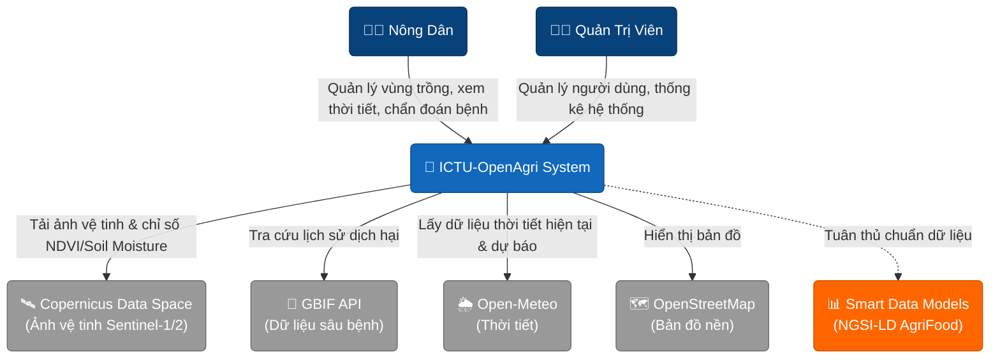
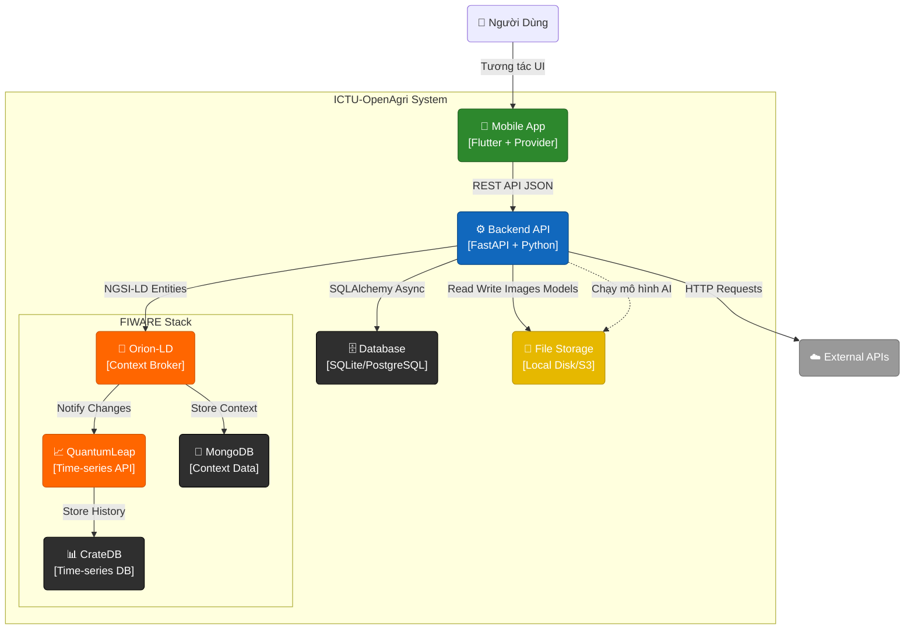
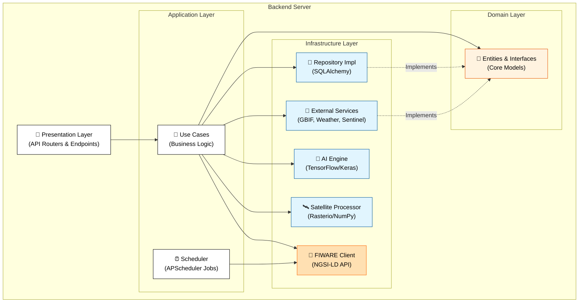
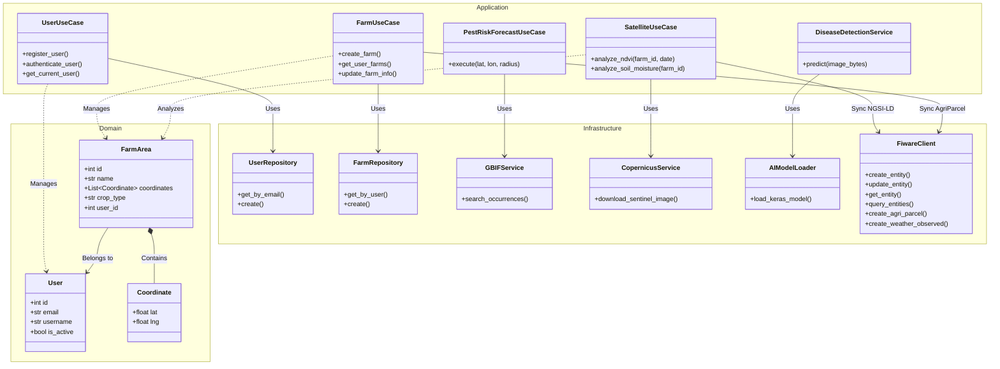

# ICTU-OpenAgri - Nền Tảng Nông Nghiệp Thông Minh


**ICTU-OpenAgri** là một nền tảng nông nghiệp số toàn diện, kết hợp sức mạnh của **Trí tuệ nhân tạo (AI)**, **Công nghệ viễn thám (Remote Sensing)**, **Bản đồ số (GIS)** và **FIWARE IoT Platform** để cung cấp giải pháp canh tác thông minh cho người nông dân và nhà quản lý.

Dự án được xây dựng với kiến trúc hiện đại (Clean Architecture), mã nguồn mở, sử dụng chuẩn dữ liệu **NGSI-LD** và các nguồn dữ liệu mở miễn phí.

---

## 🌟 Tính Năng Chính

### 1. 🛰️ Giám Sát Vệ Tinh (Satellite Monitoring)

- **Chỉ số thực vật (NDVI):** Phân tích sức khỏe cây trồng từ ảnh vệ tinh **Sentinel-2**.
- **Độ ẩm đất (Soil Moisture):** Ước tính độ ẩm bề mặt đất sử dụng dữ liệu radar **Sentinel-1**.
- **Lịch sử dữ liệu:** Theo dõi biến động của vùng trồng theo thời gian thực.
- **Nguồn dữ liệu:** [Copernicus Data Space Ecosystem](https://dataspace.copernicus.eu/).

### 2. 🦠 Chẩn Đoán Sâu Bệnh (AI Disease Detection)

- **Nhận diện bệnh:** Sử dụng mô hình Deep Learning (**TensorFlow/Keras**) để chẩn đoán bệnh cây trồng qua ảnh chụp lá.
- **Độ chính xác cao:** Được huấn luyện trên tập dữ liệu đa dạng các loại bệnh phổ biến.

### 3. 🐛 Dự Báo Dịch Hại (Pest Risk Forecast)

- **Cảnh báo sớm:** Phân tích dữ liệu lịch sử xuất hiện của sâu bệnh từ **GBIF** kết hợp với điều kiện thời tiết.
- **Bản đồ rủi ro:** Hiển thị mức độ nguy cơ bùng phát dịch hại tại địa phương.
- **Tra cứu thông tin:** Cung cấp thông tin chi tiết về các loài sâu bệnh hại.

### 4. 🌾 Quản Lý Vùng Trồng (Farm Management)

- **Bản đồ số:** Vẽ và quản lý ranh giới vùng trồng trực quan trên nền tảng **OpenStreetMap**.
- **Hồ sơ canh tác:** Lưu trữ lịch sử xuống giống, loại cây trồng, diện tích.
- **Định vị GPS:** Hỗ trợ dẫn đường và xác định vị trí lô thửa chính xác ngoài thực địa.

### 5. 🌦️ Thời Tiết & Thị Trường

- **Thời tiết nông vụ:** Cung cấp thông tin thời tiết hiện tại và dự báo 7 ngày (Nhiệt độ, độ ẩm, lượng mưa) từ **Open-Meteo**.
- **Giá cả thị trường:** Cập nhật giá nông sản hàng ngày để hỗ trợ quyết định thu hoạch và bán hàng.

### 6. 🔗 Tích Hợp FIWARE (IoT Platform)

- **NGSI-LD Standard:** Dữ liệu được chuẩn hóa theo tiêu chuẩn NGSI-LD của ETSI, tương thích với Smart Data Models.
- **Orion Context Broker:** Quản lý context data theo thời gian thực.
- **QuantumLeap & CrateDB:** Lưu trữ dữ liệu time-series cho phân tích lịch sử.
- **Smart Data Models:** Sử dụng các mô hình dữ liệu chuẩn AgriFood (AgriParcel, AgriCrop, WeatherObserved...).

### 7. 🛡️ Admin Dashboard

- **Quản trị hệ thống:** Quản lý người dùng, vùng trồng và dữ liệu toàn hệ thống.
- **Thống kê báo cáo:** Biểu đồ phân bố cây trồng, diện tích và tình hình sâu bệnh tổng quan.

---

## 🛠️ Công Nghệ & Thư Viện

### Backend (Server)

Hệ thống Backend được xây dựng bằng **Python** với kiến trúc **Clean Architecture**.

| Công Nghệ / Thư Viện                                   | Mục Đích                          | License    |
| :----------------------------------------------------- | :-------------------------------- | :--------- |
| **[FastAPI](https://fastapi.tiangolo.com/)**           | Web Framework hiệu năng cao       | MIT        |
| **[SQLAlchemy](https://www.sqlalchemy.org/)**          | ORM & Database Toolkit (AsyncIO)  | MIT        |
| **[TensorFlow](https://www.tensorflow.org/)**          | Chạy mô hình AI nhận diện bệnh    | Apache 2.0 |
| **[Rasterio](https://rasterio.readthedocs.io/)**       | Xử lý ảnh vệ tinh (GeoTIFF)       | BSD        |
| **[NumPy](https://numpy.org/)**                        | Tính toán khoa học & mảng dữ liệu | BSD        |
| **[Pydantic](https://docs.pydantic.dev/)**             | Validation dữ liệu                | MIT        |
| **[HTTPX](https://www.python-httpx.org/)**             | Async HTTP Client                 | BSD        |
| **[APScheduler](https://apscheduler.readthedocs.io/)** | Job Scheduling (Background Tasks) | MIT        |

### FIWARE Components (IoT Platform)

| Công Nghệ                                                  | Mục Đích                           | License    |
| :--------------------------------------------------------- | :--------------------------------- | :--------- |
| **[Orion-LD](https://github.com/FIWARE/context.Orion-LD)** | NGSI-LD Context Broker             | AGPL-3.0   |
| **[QuantumLeap](https://quantumleap.readthedocs.io/)**     | Time-series data handler           | MIT        |
| **[CrateDB](https://crate.io/)**                           | Time-series database               | Apache 2.0 |
| **[MongoDB](https://www.mongodb.com/)**                    | Database cho Orion Context Broker  | SSPL       |
| **[Smart Data Models](https://smartdatamodels.org/)**      | Chuẩn dữ liệu NGSI-LD cho AgriFood | CC BY 4.0  |

### Frontend (Mobile App)

Ứng dụng di động đa nền tảng (Android/iOS) được phát triển bằng **Flutter**.

| Thư Viện                                                | Mục Đích                              | License      |
| :------------------------------------------------------ | :------------------------------------ | :----------- |
| **[Flutter](https://flutter.dev/)**                     | UI Framework                          | BSD-3-Clause |
| **[Provider](https://pub.dev/packages/provider)**       | Quản lý trạng thái (State Management) | MIT          |
| **[Flutter Map](https://pub.dev/packages/flutter_map)** | Hiển thị bản đồ OpenStreetMap         | BSD-3-Clause |
| **[Dio](https://pub.dev/packages/dio)**                 | HTTP Client mạnh mẽ                   | MIT          |
| **[FL Chart](https://pub.dev/packages/fl_chart)**       | Vẽ biểu đồ thống kê                   | MIT          |
| **[Geolocator](https://pub.dev/packages/geolocator)**   | Định vị GPS                           | MIT          |

### APIs & Dữ Liệu Mở

Dự án cam kết sử dụng các nguồn dữ liệu mở và miễn phí.

| Nguồn Dữ Liệu                                                 | Loại Dữ Liệu                        | License / Policy   |
| :------------------------------------------------------------ | :---------------------------------- | :----------------- |
| **[Copernicus Data Space](https://dataspace.copernicus.eu/)** | Ảnh vệ tinh Sentinel-1 & Sentinel-2 | Free & Open Access |
| **[GBIF](https://www.gbif.org/)**                             | Dữ liệu đa dạng sinh học (Sâu bệnh) | CC0 / CC BY 4.0    |
| **[Open-Meteo](https://open-meteo.com/)**                     | Dữ liệu thời tiết                   | CC BY 4.0          |
| **[OpenStreetMap](https://www.openstreetmap.org/)**           | Dữ liệu bản đồ nền                  | ODbL               |
| **[Smart Data Models](https://smartdatamodels.org/)**         | Chuẩn dữ liệu NGSI-LD AgriFood      | CC BY 4.0          |

---

## 🚀 Hướng Dẫn Cài Đặt Chi Tiết

Để chạy dự án này trên máy cục bộ, vui lòng làm theo các bước chi tiết dưới đây.

### 📋 Yêu cầu hệ thống (Prerequisites)

Trước khi bắt đầu, hãy đảm bảo máy tính của bạn đã cài đặt các công cụ sau:

1.  **Git**: [Tải về tại đây](https://git-scm.com/downloads).
2.  **Python**: Phiên bản **3.10** trở lên. [Tải về tại đây](https://www.python.org/downloads/).
3.  **Flutter SDK**: Phiên bản Stable mới nhất. [Xem hướng dẫn cài đặt](https://docs.flutter.dev/get-started/install).
4.  **Visual Studio Code** (Khuyên dùng) hoặc Android Studio.

---

### 1️⃣ Thiết lập Backend (Server)

Backend chịu trách nhiệm xử lý dữ liệu, AI và kết nối cơ sở dữ liệu.

**Bước 1: Clone dự án**
Mở terminal (Command Prompt hoặc PowerShell) và chạy lệnh:

```bash
git clone https://github.com/CuongKenn/ICTU-OpenAgri.git
cd ICTU-OpenAgri/backend
```

**Bước 2: Tạo môi trường ảo (Virtual Environment)**
Giúp cách ly thư viện của dự án với hệ thống.

```bash
# Windows
python -m venv venv
venv\Scripts\activate

# macOS / Linux
python3 -m venv venv
source venv/bin/activate
```

_(Khi kích hoạt thành công, bạn sẽ thấy chữ `(venv)` ở đầu dòng lệnh)_

**Bước 3: Cài đặt thư viện phụ thuộc**

```bash
pip install -r requirements.txt
```

**Bước 4: Cấu hình biến môi trường**
Tạo file `.env` trong thư mục `backend` (copy từ `.env.example` nếu có) và điền các thông tin sau:

```ini
# Cấu hình chung
PROJECT_NAME="ICTU-OpenAgri"
ENVIRONMENT="development"
API_V1_STR="/api/v1"

# Bảo mật (JWT)
SECRET_KEY="thay_doi_chuoi_nay_thanh_mat_khau_bi_mat_cua_ban"
ALGORITHM="HS256"
ACCESS_TOKEN_EXPIRE_MINUTES=30

# Tài khoản Admin mặc định (Tự động tạo khi khởi chạy lần đầu)
ADMIN_EMAIL="admin@openagri.com"
ADMIN_PASSWORD="admin123"

# Dữ liệu vệ tinh (Đăng ký tại dataspace.copernicus.eu)
COPERNICUS_USERNAME="your_username"
COPERNICUS_PASSWORD="your_password"
```

**Bước 5: Khởi chạy Server**

```bash
uvicorn app.main:app --reload --host 0.0.0.0 --port 8000
```

- Server sẽ chạy tại: `http://localhost:8000`
- Tài liệu API (Swagger UI): `http://localhost:8000/api/docs`

---

### 2️⃣ Thiết lập Frontend (Mobile App)

**Bước 1: Di chuyển vào thư mục frontend**

```bash
cd ../frontend
```

**Bước 2: Kiểm tra môi trường Flutter**
Chạy lệnh sau để đảm bảo mọi thứ đã sẵn sàng (không có lỗi màu đỏ):

```bash
flutter doctor
```

**Bước 3: Cài đặt các gói thư viện**

```bash
flutter pub get
```

**Bước 4: Chạy ứng dụng**
Kết nối điện thoại hoặc bật máy ảo, sau đó chạy:

```bash
flutter run
```

---

### 3️⃣ Hướng Dẫn Build/Compile Ứng Dụng (Production)

Để tạo ra file cài đặt (.apk, .ipa) cho thiết bị thật hoặc đưa lên kho ứng dụng, bạn cần thực hiện quy trình build.

**Lưu ý quan trọng:**

- Đảm bảo bạn đã cấu hình đúng `signing config` (chữ ký số) nếu muốn đưa lên Google Play hoặc App Store.
- Đối với Android, file kết quả sẽ nằm trong thư mục `build/app/outputs/flutter-apk/`.

#### 📱 Build cho Android

**Tạo file APK (Cài đặt trực tiếp):**

```bash
flutter build apk --release
```

_Lệnh này tạo ra file APK tối ưu hiệu năng để cài đặt thủ công trên thiết bị Android._

**Tạo Android App Bundle (Đăng tải Google Play):**

```bash
flutter build appbundle
```

_File `.aab` được Google Play yêu cầu để tối ưu hóa kích thước tải về cho từng thiết bị._

#### 🍎 Build cho iOS (Yêu cầu macOS)

Để build ứng dụng cho iPhone/iPad, bạn cần máy tính Mac có cài đặt Xcode.

```bash
flutter build ipa
```

_Sau khi build xong, mở Xcode để thực hiện Archive và Upload lên TestFlight hoặc App Store._

#### 🌐 Build cho Web

```bash
flutter build web
```

_Kết quả sẽ nằm trong thư mục `build/web`. Bạn có thể deploy thư mục này lên bất kỳ web server nào._

---

### 4️⃣ Chạy bằng Docker (Khuyên dùng)

Nếu bạn muốn chạy nhanh toàn bộ hệ thống với đầy đủ FIWARE components:

1.  Cài đặt [Docker Desktop](https://www.docker.com/products/docker-desktop/).
2.  Tại thư mục gốc của dự án, chạy:
    ```bash
    docker-compose up --build
    ```
3.  Hệ thống sẽ tự động khởi tạo:
    - **Backend API**: `http://localhost:8000`
    - **Frontend Web**: `http://localhost:3000`
    - **Orion Context Broker**: `http://localhost:1026`
    - **QuantumLeap API**: `http://localhost:8668`
    - **CrateDB Admin**: `http://localhost:4200`
    - **MongoDB**: `localhost:27017`

---

## 📄 License

Dự án này được phân phối dưới giấy phép **MIT License**. Xem file [LICENSE](LICENSE) để biết thêm chi tiết.

---

## 🏗️ Kiến Trúc Hệ Thống (C4 Model)

Hệ thống được thiết kế theo mô hình **C4 Model** kết hợp với **Clean Architecture** ở phía Backend để đảm bảo tính tách biệt, dễ bảo trì và mở rộng.

### Level 1: System Context (Bối cảnh hệ thống)

Mô tả sự tương tác giữa người dùng và các hệ thống bên ngoài.



### Level 2: Container (Thành phần chứa)

Chi tiết các thành phần chính và công nghệ sử dụng.



### Level 3: Component (Kiến trúc Backend)

Chi tiết kiến trúc **Clean Architecture** bên trong Backend Server.



### Level 4: Code (Chi tiết thực thi toàn hệ thống)

Biểu đồ lớp (Class Diagram) dưới đây cung cấp cái nhìn tổng quan về cấu trúc mã nguồn của toàn bộ hệ thống Backend, minh họa mối quan hệ giữa các **Entities** (Domain), **Use Cases** (Application), và **Services** (Infrastructure).



**Giải thích:**

- **Domain**: Chứa các thực thể cốt lõi (`User`, `FarmArea`) đại diện cho dữ liệu nghiệp vụ.
- **Application**: Chứa các logic nghiệp vụ (`UseCases`), điều phối luồng dữ liệu giữa UI và Infrastructure.
- **Infrastructure**: Chứa các lớp thực thi cụ thể như truy cập Database (`Repository`), gọi API bên ngoài (`Service`), và đồng bộ dữ liệu với FIWARE (`FiwareClient`).

---

## 📂 Cấu Trúc Dự Án

```
ICTU-OpenAgri/
├── backend/                 # Backend Server (FastAPI)
│   ├── app/                 # Source code chính
│   │   ├── application/     # Business Logic (Use Cases, DTOs)
│   │   ├── domain/          # Entities & Interfaces (Core)
│   │   ├── infrastructure/  # Database, External Services, AI, FIWARE
│   │   ├── presentation/    # API Endpoints & Dependencies
│   │   ├── scheduler.py     # Background Jobs (FIWARE Sync)
│   │   └── main.py          # Entry point
│   ├── data/                # Dữ liệu NGSI-LD (Smart Data Models)
│   │   ├── vietnam_pest_ngsi_ld.json         # Dữ liệu sâu bệnh
│   │   ├── vietnam_commodity_prices_ngsi_ld.json  # Giá nông sản
│   │   └── vietnam_32_provinces_soil_ngsi_ld.json # Dữ liệu đất
│   ├── ml_models/           # Mô hình AI (Keras/TensorFlow)
│   ├── output/              # Dữ liệu đầu ra (Ảnh vệ tinh đã xử lý)
│   ├── tests/               # Unit Tests
│   ├── Dockerfile           # Cấu hình Docker cho Backend
│   └── requirements.txt     # Danh sách thư viện Python
│
├── frontend/                # Mobile App (Flutter)
│   ├── android/             # Cấu hình Android Native
│   ├── ios/                 # Cấu hình iOS Native
│   ├── lib/                 # Source code Dart
│   │   ├── config/          # Cấu hình App (Theme, Routes)
│   │   ├── models/          # Data Models
│   │   ├── screens/         # Màn hình UI chính
│   │   ├── services/        # API Services (Retrofit/Dio)
│   │   ├── viewmodels/      # State Management (Provider)
│   │   ├── views/           # Các thành phần UI nhỏ (Partial Views)
│   │   ├── widgets/         # Widgets tái sử dụng (Common Widgets)
│   │   └── main.dart        # Entry point
│   ├── assets/              # Tài nguyên (Hình ảnh, Icons)
│   └── pubspec.yaml         # Quản lý thư viện Flutter
│
├── docker-compose.yml       # Cấu hình chạy toàn bộ hệ thống (Docker)
├── Makefile                 # Các lệnh tiện ích (Build, Run)
└── README.md                # Tài liệu dự án
```

## 🤝 Đóng Góp (Contributing)

Chúng tôi rất hoan nghênh mọi đóng góp từ cộng đồng! Để đóng góp:

1.  **Fork** dự án này.
2.  Tạo nhánh tính năng mới (`git checkout -b feature/AmazingFeature`).
3.  Commit thay đổi của bạn (`git commit -m 'Add some AmazingFeature'`).
4.  Push lên nhánh (`git push origin feature/AmazingFeature`).
5.  Mở một **Pull Request**.

Vui lòng xem file `CONTRIBUTING.md` để biết thêm chi tiết quy tắc ứng xử.

## 🐛 Báo Lỗi (Bug Tracker)

Nếu bạn phát hiện lỗi hoặc muốn yêu cầu tính năng mới, vui lòng tạo issue tại:
[https://github.com/CuongKenn/ICTU-OpenAgri/issues](https://github.com/CuongKenn/ICTU-OpenAgri/issues)

## 📄 Giấy Phép (License)

Dự án này được phân phối dưới giấy phép **MIT License**. Xem file `LICENSE` để biết thêm chi tiết.

## 📞 Liên Hệ

- **Tác giả**: CuongKenn
- **GitHub**: [https://github.com/CuongKenn/ICTU-OpenAgri](https://github.com/CuongKenn/ICTU-OpenAgri)

---

_Dự án được phát triển với ❤️ cho nền nông nghiệp số._
